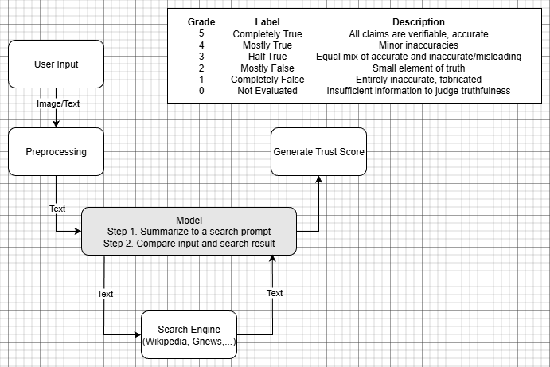

# AI for Disinformation Detection

## Problem Statement

In the age of generative AI, disinformation in textual content is spreading rapidly across social platforms, news media, and messaging apps. This poses serious risks to public trust, journalism, democratic processes, and societal stability. Current solutions tend to be reactive, limited in scope, and lack explainability.

We aim to build a proactive, multilingual system to detect potential disinformation, verify claims using credible sources, and enhance user trust through transparency and context.

## Project Idea

An LLM-based system that flags inconsistencies in text/audio/video and verifies claims using trusted sources.

### Key Features:
- Plugin/API for social platforms and CMS tools  
- Built-in citation and counter-narrative generation  
- Real-time or batch processing of user content  
- Language-agnostic entity extraction and fact verification  

## Getting Started

### 1. Clone the Repository

```bash
git clone https://github.com/yourname/AIforDisinformation.git
cd AIforDisinformation
```

### 2. Install Requirements
Make sure you have Python 3.11+ installed. Then install dependencies:
```
pip install -r requirements.txt
```

### 3. Run the Application
```
python app.py
```
This will start the Gradio interface locally:
```
http://127.0.0.1:7860
```

### Image Deepfake Detection
- Upload an image using the Image Input section of the interface.
- The model will evaluate it and indicate whether it is AI-generated (deepfake) or real, along with a confidence score.
- ⚠️ This runs entirely on your machine, so performance depends on your local hardware (a GPU is recommended for faster inference).

### Text Disinformation Detection
- Enter text or a factual claim in the Text Input (Chatbot) section.
- The system analyzes it using a large language model and checks for factuality.
- It uses tools like DuckDuckGo Search, structured knowledge bases, and custom logic to verify claims.
- Outputs include a trust score, counter-narrative suggestions, and citations.
---



## System Overview (Pipeline)

### 1. Ingestion Layer
- Accepts raw text, URLs, or documents (e.g. PDF, HTML)  
- Optional API endpoints for third-party integration  

### 2. Preprocessing
- Text extraction (HTML/Markdown parsing, PDF processing)  
- OCR to convert images to text, and ASR to convert audio to text  
- Language detection and normalization  
- Sentence-level segmentation and entity recognition  

### 3. Detection Engine
LLM (Qwen-32B) fine-tuned to detect:
- Hallucinations  
- Logical fallacies  
- Propaganda techniques  
- Inconsistencies across multiple claims  

### 4. Claim Verification
- Extracts factual claims using NLP-based claim mining  
- Verifies against:
  - Google Fact Check API  
  - Wikidata / DBpedia / Snopes  
  - Trusted news sources via GNews or custom scrapers  
- Scores reliability and assigns a **Trust Index**  

### 5. Explainability & UI Layer
Annotates text with:
- Verified/unverified claim highlights  
- Citations with credibility scores  
- Suggested corrections or alternate views  
- Generates a summary with a **Trust Score Badge**  

### 6. Output/API Layer
- Web dashboard for visualization and reports  
- Optional browser plugin for real-time flagging (e.g. on Twitter, YouTube comments, Substack)  
- Export as structured JSON or annotated HTML  
