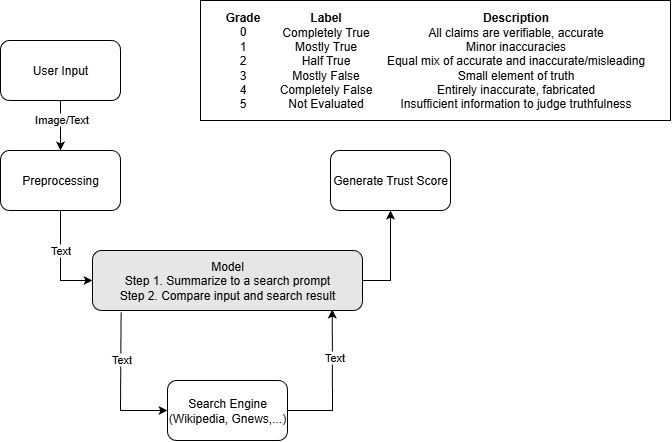

# AI for Disinformation Detection

## Problem Statement

In the age of generative AI, disinformation in textual content is spreading rapidly across social platforms, news media, and messaging apps. This poses serious risks to public trust, journalism, democratic processes, and societal stability. Current solutions tend to be reactive, limited in scope, and lack explainability.

We aim to build a proactive, multilingual system to detect potential disinformation, verify claims using credible sources, and enhance user trust through transparency and context.

## Project Idea

An LLM-based system that flags inconsistencies in text/audio/video and verifies claims using trusted sources.

### Key Features:
- Plugin/API for social platforms and CMS tools  
- Built-in citation and counter-narrative generation  
- Real-time or batch processing of user content  
- Language-agnostic entity extraction and fact verification  

---

## System Overview (Pipeline)

### 1. Ingestion Layer
- Accepts raw text, URLs, or documents (e.g. PDF, HTML)  
- Optional API endpoints for third-party integration  

### 2. Preprocessing
- Text extraction (HTML/Markdown parsing, PDF processing)  
- OCR to convert images to text, and ASR to convert audio to text  
- Language detection and normalization  
- Sentence-level segmentation and entity recognition  

### 3. Detection Engine
LLM (Qwen-32B) fine-tuned to detect:
- Hallucinations  
- Logical fallacies  
- Propaganda techniques  
- Inconsistencies across multiple claims  

### 4. Claim Verification
- Extracts factual claims using NLP-based claim mining  
- Verifies against:
  - Google Fact Check API  
  - Wikidata / DBpedia / Snopes  
  - Trusted news sources via GNews or custom scrapers  
- Scores reliability and assigns a **Trust Index**  

### 5. Explainability & UI Layer
Annotates text with:
- Verified/unverified claim highlights  
- Citations with credibility scores  
- Suggested corrections or alternate views  
- Generates a summary with a **Trust Score Badge**  

### 6. Output/API Layer
- Web dashboard for visualization and reports  
- Optional browser plugin for real-time flagging (e.g. on Twitter, YouTube comments, Substack)  
- Export as structured JSON or annotated HTML  
